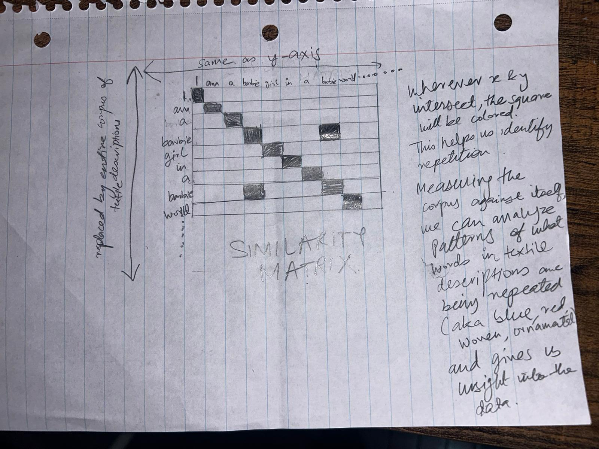

# Qualitative sketches - Textiles at the Smithsonian

1. A map where textiles are "threaded" from their original countries' to the Smithsonian musuems they are held at today. The map animates with a timeline.

 2) A self similarity matrix showing repeitition and patterns among the textiles' descriptions.

 3) Images of textiles are clustered based on similarity of description. Micro view includes transparent overlays of the images in a given cluster to create a "composite" fabric view. Description of each textile will be shown on back of image card and images can be lined up in a grid when clicked through.
